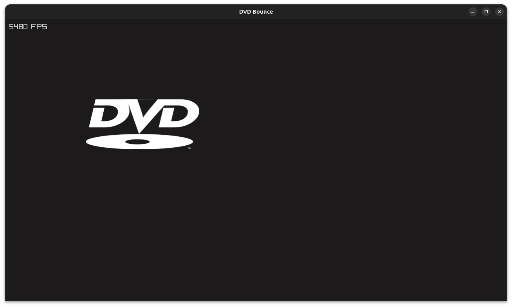

# DVD_Raylib
A "simple" project which utilises Raylib to make a bouncing DVD window thingy.

# Other Branches
- [`main`][mbranch] - The same project, made with SDL3.
  - [x] **NO** FPS Counter
  - [x] **MORE** lines of code
  - [x] A genuinely awful experience

# Features
- [x] Bouncing capabilities
  - [x] Colour-changing ability
  - [x] Bounce SFX
  - [x] No randomness so it follows the same path over and over until you resize the window to set it on a new path lol

# Building
This should (*hopefully*) be cross-platform on anything that Raylib supports.
## Linux
1. Install CMake
2. Do CMake stuff to build
3. You probably need Ninja, idk

[mbranch]: https://github.com/StupidRepo/DVD_SDL3/tree/main
