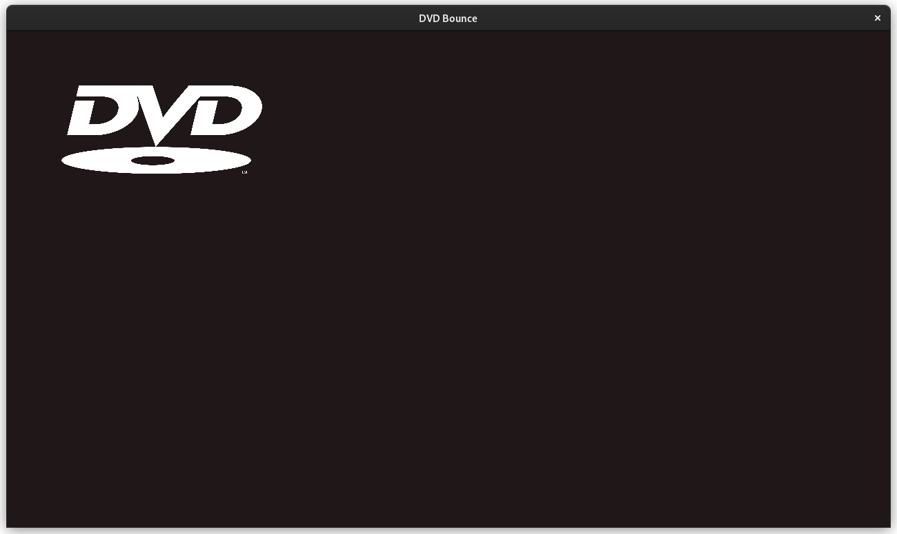

# DVD_SDL3
A "simple" project I made which allows you to have an SDL3 bouncing DVD window thingy.

# Features
- [x] Annoying airhorn sfx when hitting a corner near-perfectly
- [x] Bouncing
- [x] No randomness so it follows the same path over and over until you resize the window to set it on a new path lol

# Building
This should (*hopefully*) be cross-platform on anything that SDL3 supports.
## Linux
1. Install CMake
2. Do CMake stuff to build
3. You probably need Ninja, idk